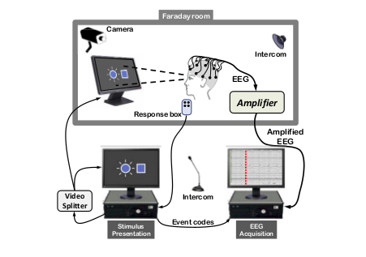

## Contributors:

#### Cristina Zappullo
  - Role: Writer
  - Email: [cristinazappullo@gmail.com](mailto:cristina.zappullo@gmail.com)
  - LinkedIn: [https://www.linkedin.com/in/cristinazappullo/](https://www.linkedin.com/in/cristinazappullo/)
  - Website: [www.cristinazappullo.com](www.cristinazappullo.com)
  - Slack: chrisz

#### Sheida
  - Role: Mentor
  - Email: sheidarabipour@gmail.com
  - Slack:

## Introduction

Experiments demonstrate a theoretical thesis given the hypothesis. The reason of running an experiments in the first place is because there is something unknown to be learn. In experiments specificity and preparation are your friends. A very specific thesis is easier to prove and establishing parameters, subjects requirements and tests protocols in order to study some aspect of the brain is more efficient. Usually subjects give one day availability and they don't come for do-overs. It is also very difficult to find many subjects in EEG experiments. Therefore use what resources you have at the maximum and cross your fingers you end up gathering everything you need to demonstrate your thesis.

While planning an experiment you should consider: subjects, location, setup, data analysis, results visualization and findings publications.

## SUBJECTS 1

### Subjects selection criteria

Before you advertise the experiment and gather participants, you have to decide on subject criteria. Selected subjects have to meet all pre-determined requirements. Those are designed to match the hypotheses, laws and ethical regulations. The requirements that match the hypotheses differ from experiment to experiment. The requirements that match laws and regulations are common for all EEG experiments. Those ensures safety for all participants and may vary slightly from country to country (but they are generally similar).

Common selection criteria are:

- general good health,
- no pregnancy,
- no claustrophobia,
- no drug addiction,
- no neurological diseases.

Specific selection criteria that differs from experiment to experiment to take into account:

- range of age,
- ne or both genders,
- academic level,
- specific type of disease or the absence of it (in case of studies on  dementia or other diseases),
- visual acuity and/or hearing acuity (depending on the type of stimuli which subjects are exposed to during the  experiment),
- if the person is left handed or right handed.

### Subjects population and groups

The subjects can all have the same requirements or divided in groups that differs by some criteria. Single group experiments are useful to study a specific phenomenon. Two or more groups are useful to study whether the difference affects  any values. When studying a mental healthy group and a group affected by a mental disease, the first group is usually called *control group*.

### Subjects data selection

A later subjects selection stage happens after subjects cleared for the test take it. The data gathered is not always clear enough to process. Some of the reasons to reject a subject after recording are:

- lack of signal for a specific time window,
- external sudden electrical noises that ruin the signal,
- electrodes shifting or falling due to subject mis-comfort that cause the signal to drop.

It is recommended to check the data before starting processing. In case of missing data, the subject can be rejected or brought in again for additional tests.

## EEG SETUP

The EEG experimental protocol requires acquisition and processing. Participants are interfacing with the acquisition setup in the recording room. Once the experimenter acquires the EEG data, they can also process it in a secondary location or store it. The personnel involved the two steps differs as well:

- Medical staff interact with the subjects and extract the data,
- biomedical engineers or scientists process the signal.

### EEG acquisition setup block

Fig. 1 shows the general block for acquiring the signal during an experiment using visual or auditory evoked potentials.

 

*Fig.1 setup for EEG acquisition 1

#### Blocks 2

To obtain EEG data we need a stimulation block, a recording block and the hardware to synchronize the two.

Stimulating equipment

The stimulating equipment depends on the experiment. Using Evoked potentials, the stimulation setup requires:

- a screen in case of visual stimulation,
- a sound generator in case of hearing stimulation,
- a pressure system in case of tactile stimulation and
- a TMS block in case of TMS stimulation.

Acquisition equipment

The acquisition system has at least a sampling rate of 3kHz. The acquisition setup has:

- a different sizes controlled cap with sensors (passive or active),
- an electronic circuit for amplification (compatible amplifier EEG data fusion module and trigger via parallel port) and frequency filtering,
- a software or hardware that allows measure of impedance, and
- a computer to register the acquired signal.

#### Synchronization system

When the stimulation occurs is an essential information. Either the software records the stimulation time or the stimuli are visible on the EEG signal track. During testing the medical staff should check whether it's been recorded. In case it isn't, they should restart the test when possible, record it from then when it's not.

#### Security measures

- The recording site has to be in a electrophysiology Faraday room, to avoid currents passing through the body.
- The EEG system has to be galvanically decoupled from the battery and  the active electrodes. Usually the system is powered using a transistor to isolate the two parts.

#### Practical measures

- The room temperature has to be around 20°C to avoid the subject feeling too hot or too cold. Any sweating could cause the electrodes  to not adhere well enough to the skin and affect the potential. Any shivering could cause the electrodes to move and affect the potential.
- In case of a visual test, the screen has to be at optimized visual field level for the subjects. The screen has to be high adjustable and the seat comfortable and stable. Uncomfortable position affects the EEG and produces  artifacts.

### EEG processing setup

The EEG signal processing requires a computer with enough processing power to handle several recordings tens of MB large.

The software needed depends on the experiment target, the budget and on the experimenter's skills. There are many software environments and programs available.

The most famous environments are Matlab and Rstudio. Each of them have specific libraries for EEG signal processing: EEGlab for Matlab and EEGkit for Rstudio.

Among the useful programs, there are some to visually process EEG. Some are useful to get a general idea of the signal shape and frequency range. EEGview is one of them. Other programs further process the signal and provide other information on the data. sLoreta, for example, produces low resolution electromagnetic tomography from the EEG recordings. The method's hypothesis is that the brain works similarly to an electronic circuit. sLoreta uses the data from the potentials on the scalp recorded with the electrodes. It hypothesizes the resistance of the brain, based on medical studies. So it estimates the electrical neuronal activity distribution (current density vector field). This program also provides 3D model of the head and maps of the distribution.

##STIMULI 3,4

### EP / non EP

The focus on the study defines whether use EP or non-EP.

The non-EP studies map the baseline of the mind. EEG activity recorded during relaxation and sleep are part of the non-EP data. They map the brain of subjects affected by selected diseases and physical states (like being drugged, being asleep or in a coma).

The signal before the evoked potential spikes is usually a relaxation signal, called baseline. The nonEP is also used as the signal for the removal of the baseline during EP signal processing.

EP experiments study a specific path inside the brain. From the visual nerve or the hearing system, the cognitive response to a stimulus. There are four kinds of evoked potentials.

#### EVOKED POTENTIALS

Evoked potential are a non-invasive way to study sensory pathways abnormalities. They are transient waves on the EEG after each stimulus. These are the hypothesis made on the resulting signal:

- the resulting signal is the total sum of noise, brain activity signal and the response to the stimuli;

- the response is invariant over repeated stimulation, the  least noisy result is the average short wave of all the responses.

The parameters of interests are:

- latency, the time difference between the stimuli and the electrical response is visible on the EEG;

- morphology of the wave, it depends on the position of the specific electrode on the scalp and the physiological response of the subject. Amplitude may vary from 1 to 10 \mu V.

Variation in the values of the parameters could be caused by different kinds of neurological impairments.

#### *Visual Evoked Potential*

The Visual Evoked Potential (VEP) with clinical significance is from N75 on.

A video screen generates the stimulation. The most common protocol uses a chessboard pattern (black and white squares) displayed on the screen. A dot of a different color is positioned on the center of the screen, in high contrast with the background pattern. The subject's task is to focus on the fixed dot while the background chessboard switches colors: the squares go from black to white to back again. The repetition rate could change, the frequency rate is from 1 to 300 Hz.

In case of subjects with lack of focus or unable to keep their gaze fix, a flash stimulus on a dark screen is used as stimulation.

#### *Auditory Evoked Potential*

The Auditory Evoked Potential (AEP) experiments study the propagation of the signal from the acoustic nerve to the cortex. The tree responses depend on the latency:

- the brainstem response (from 0.1 to 0.5 μV up to 12 ms after the stimulus, generated by up to seven waves),
- the middle response (from 12 to 50 ms) and
- late cortical responses (up to 20 \mu V).

The sound delivery system consist of headphones. The subject listen to different series of click-like sounds from one or both sides at once. The experimenter masks the non stimulated ear with a band limited noise, called _pink noise_. Usual repetition rate varies from 8 to 10 clicks per second, with a pressure level going from 40 to 120 dB. The electrodes behind the ears record the stimuli used to isolate the AEP window.

#### *Somatosensory Evoked Potential*

Somatosensory Evoked Potentials (SEP) give information about the nerve conduction functionality.

The clinically interesting data are up to the N40. It describes the neuronal connection between the cerebral cortex, the spinal cord and the nerve stimulated (usually is the median nerve, the tibial nerve and the peroneal nerve).

Fingers or legs are stimulated by electrodes situated in proximity of the sensory nerve fibers.

#### *TMS*

The Transcranial Magnetic Stimulation (TMS) is a non invasive experiment. It measures the cortical excitability by inhibiting or improving it. It is the only stimulation that testes higher cognitive areas. It requires a specific medical instrument to create the magnetic stimulation.

## EXPERIMENTAL PROCEDURE 1

#### Recruiting subjects

- Advertise the experiments and the subjects requirements within fellow research groups, hospitals, and medical centers.
- Screen possible choices and arrange appointment for testing.
- Instruct the subject to come to the test with just washed hair and no hair products, and to be on their best physical and mental         conditions.

#### Before the experiment

- Prepare information notice, instruction paper and consent paper,
- verify and test the setup, the stimulation system and routine, the hardware in the workspace,
- check connection with recording system,
- Prepare your gel syringes if you are using wet electrodes.

#### During the experiment

- Welcome the subject in the lab, make them feel comfortable,
- explain the experiment and make sure the subject is clear on any aspect of it,
- have subject sign the consent paper,
- adjust the stimulation set up to subject confort (adjust chair height, screen distance or check sound),
- prepare head and secure selected cap,
- perform impedance measurement,
- perform testing,
- verify the obtained signal is properly electrophysiological,
- keep the subject attentive and motivated, allow for breaks.

## REFERENCES

1 Maureen Clerc, &quot;Brain–Computer Interfaces 2 - Technology and Applications&quot;, Wiley

2 Branca, &quot;Fondamenti di Ingegneria Clinica, Vol.1&quot;, Springer

3 Leif SÃrnmo, Pablo Laguna, &quot;Bioelectrical Signal Processing in cardiac and neurological processing&quot;, Elsevier

4 Nitish Vyomesh Thakor, Shanbao Tong, &quot;Quantitative EEG Analysis Methods and Clinical Applications&quot; Engineering in Medicine and Biology
