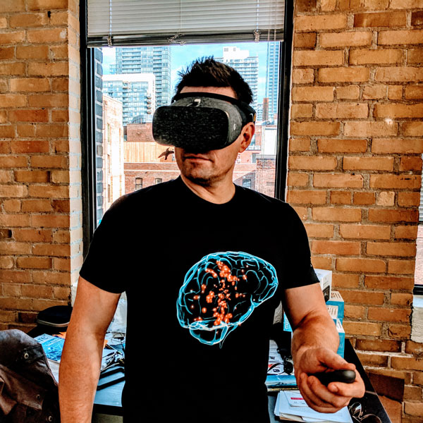
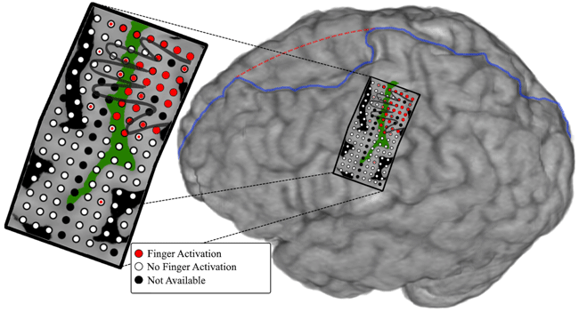
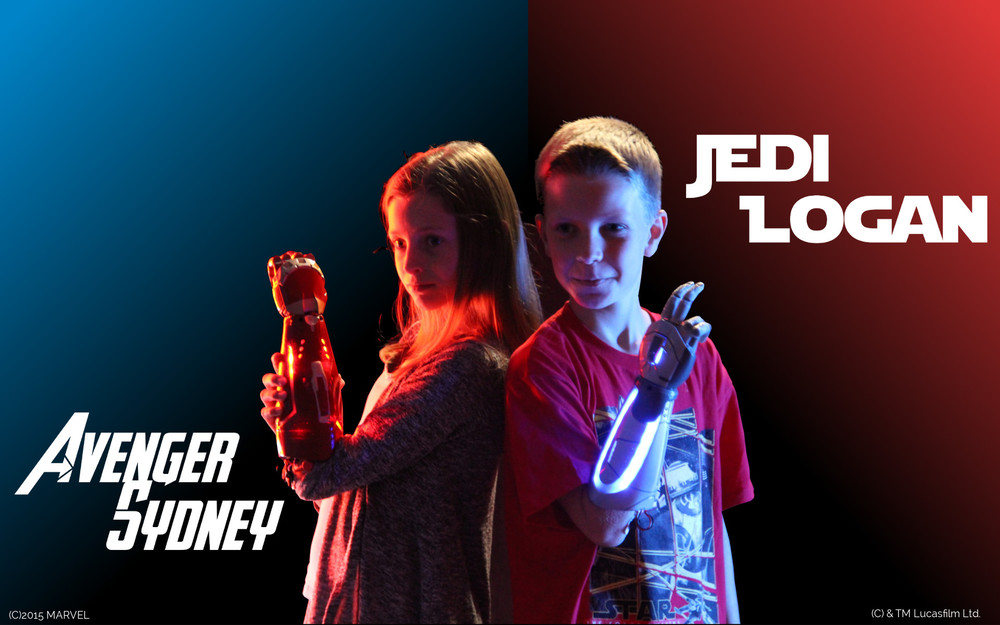
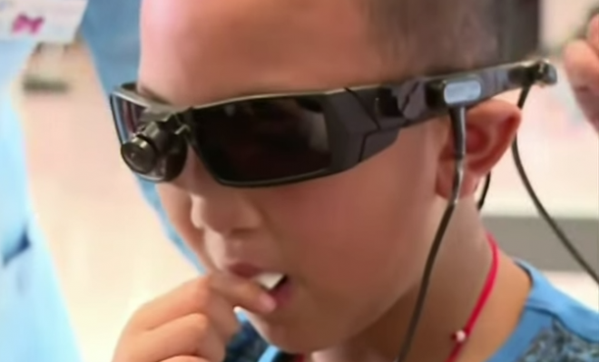
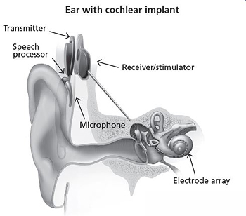
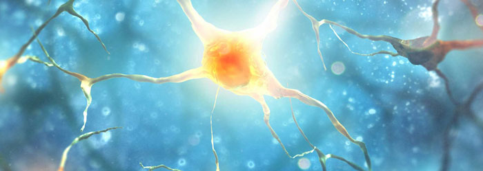

**Table of Contents**
{: #toc }
*  TOC
{:toc}

<!-- /.medium-4.columns -->

## Virtual Reality

Once the stuff of science fiction, virtual reality is on the cusp of becoming part of our day-to-day lives thanks to mounting technological advances. Many popular VR headsets are ushering in exciting new ways to play and interact with the world. As these devices continue to evolve, we believe that EEG algorithms can add the extra layer of immersion needed to truly complete the virtual reality experience.

Swiss neurotechnology company MindMaze has conceived the ultimate — or at least somewhere around the penultimate — cyberpunk VR setup. Imagine a blocky virtual reality headset that looks like a bezeled Oculus Rift. Where a Rift developer might track your hands by mounting a Leap Motion to the front of the headset, MindMaze has integrated a Kinect-like combination of cameras and depth sensors, capable of finding your hands with some degree of accuracy. Instead of a strap, though, there's a rope-and-plastic net that covers the crown of your head.

And, theoretically, reads your thoughts.

[http://neurosky.com/2016/04/a-new-virtual-reality-the-rise-of-vr-headsets-eeg/](http://neurosky.com/2016/04/a-new-virtual-reality-the-rise-of-vr-headsets-eeg/)

[http://www.theverge.com/2015/3/3/8136405/mind-maze-mind-leap-thought-reading-virtual-reality-headset](http://www.theverge.com/2015/3/3/8136405/mind-maze-mind-leap-thought-reading-virtual-reality-headset)

[https://www.cnet.com/news/this-vr-headset-is-designed-to-let-you-find-your-zen/](https://www.cnet.com/news/this-vr-headset-is-designed-to-let-you-find-your-zen/)

## NeuroEnterntainment

#### Neurogaming

Visit NeuroSky for a great [selection of games.](http://store.neurosky.com/collections/apps/games)

#### NeuroToys

[Puzzlebox has various devices and gadgets related to neuroscience.](https://puzzlebox.io/)

There are also Star Wars-themed toys! [Learn more.](http://starwarsscience.com/product/the-force-trainer-ii-hologram-experience/)

## Security

#### Brain based authentication

<iframe width="560" height="315" src="https://www.youtube.com/embed/vhJM00V1Xu4" frameborder="0" allowfullscreen></iframe>

#### NeuroPrivacy

Scientists believe the ability to scan brain activity has the potential to yield knowledge about the inner workings of an individual’s brain. Some researchers al ready claim to be able to discover certain unconscious preferences or to detect when someone is lying about being exposed to certain information based upon cerebral activity. Brain research is beginning to raise numerous legal and social policy questions including: What information is going to be discovered? Who will have access to it? How will the information be used? What privacy rights does a person have to his or her thoughts?

The study of the ethical, legal and social implicati ons of neuroscience is being referred to “neuroethics.” 1 Many types of brain research have, or will have, legal implications. However, this article will focus on the privacy concerns with respect to mental and cerebral functioning as delineated through brain imaging and other neurodiagnostic techniques—or what will be referred to here as “neuroprivacy.”

The purpose of this report is to view potential legal questions within the context of existing brain imaging technology, applications and protections. The first sect ion summarizes current technologies. The reliability of these technologies will be addressed in the second section. Potential applications of this technology and some of the legal implications will be discussed in the third sect ion. The fourth section will review existing protections. Lastly, issues that have arisen in the area of genetic pr ivacy will be reviewed and compared to similar concerns that might arise with respect to brain privacy concerns.

[http://www.nycbar.org/pdf/report/Neuroprivacy-revisions.pdf](http://www.nycbar.org/pdf/report/Neuroprivacy-revisions.pdf)

## Biofeedback Therapy

#### Anxiety

Electroencephalography (EEG) feedback, also known as neurofeedback or neurotherapy, was originally developed as a relaxation technique related to meditation (Kamiya, 1969; Michael, Krishnaswamy, & Mohamed, 2005). EEG involves measuring the general patterns of activity of the brain and can be used as a diagnostic assistant (usually via quantitative EEG or qEEG) or feedback tool (Hammond, 2010, 2011). Feedback can be auditory or visual, even in the form of a computer game. In this way, participants learn to regulate specific frequencies of cortical activity. As a feedback therapy, it has been used in many different psychological and medical disorders, including attention deficit-hyperactivity disorder, autism spectrum disorder, and substance use disorder (Myers & Young, 2012). It has also been used to treat the more cognitive components of anxiety disorders and may be more effective in those disorders in which the cognitive experience is central, such as generalized anxiety disorder (Schoenberg & David, 2014). Most practitioners claim there is little to no short-or long-term risk involved in neurofeedback, but some caution that to minimize risk it is critical to individualize treatment using qEEG because of the heterogeneity of EEG presentations of various disorders and comorbidities (Hammond, 2010; Walker, 2010).

[https://concept.journals.villanova.edu/article/view/1831/1754](https://concept.journals.villanova.edu/article/view/1831/1754)

#### Sleep Improvement

Aurora is the first smart wearable device built from the ground up to enhance REM dreaming. Aurora awakens your mind at opportune moments during dreams to improve dream recall and clarity. Learn techniques used for centuries by professional artists, scientists and athletes to leverage REM sleep for creative problem solving. Wake up with purpose and enjoy the real cognitive benefits associated with enhanced sleep and dreams!

Learn your personal sleep architecture and get better rest as you maximize your sleep efficiency with brainwave-enabled insights. Let Aurora's intelligent Smart Alarm gently wake you at the best point in your cycle, leaving you feeling fully revitalized and ready to take on the day.

[https://iwinks.org/](https://iwinks.org/)

Gold-plated EEG sensors measure brainwaves' activity during your sleep. Neuroon tracks pulse, temperature and movement too to get even more accurate picture of your sleep.

Gold-plated EEG sensors measure brainwaves' activity during your sleep. Neuroon tracks pulse, temperature and movement too to get even more accurate picture of your sleep.

[https://neuroon.com/sleep-tracking/](https://neuroon.com/sleep-tracking/)

[http://sleepshepherd.com/](http://sleepshepherd.com/)

#### ADHD

At Akili, we're in the process of building clinically-validated cognitive therapeutics, assessments, and diagnostics that look and feel like high-quality video games. Our aim is to develop a new type of Digital Medicine that can be deployed remotely directly to any patient anywhere, prescribed and tracked by physicians.

Akili was co-founded by PureTech, leading cognitive neuroscientists, and top-tier entertainment software creators. Our operational team is a mix of biomedical scientists and experts in medical device commercialization and interactive design.

[http://www.akiliinteractive.com/](http://www.akiliinteractive.com/)
[https://www.emotiv.com/product/stonehenge/](https://www.emotiv.com/product/stonehenge/)

#### PTSD

The majority of PTSD patients continue to have substantial symptoms after treatment ends. Less than half of those entering psychotherapy improved significantly. Treatments for combat-related trauma showed the lowest level of benefit. Even the most effective available treatments do not result in full recovery for the majority of veterans with PTSD. In published research and our experience, neurofeedback is consistently helpful in reducing or eliminating the symptoms of PTSD.

Neurofeedback, also called EEG biofeedback or neurotherapy, is a research proven way to help you improve your brain function through intensive brain training exercises. Although the technology is quite sophisticated, the process is simple, painless, and non-invasive. It is just learning. You learn to alter your brain activity the same way you learn every other skill – through feedback and practice.

[https://neurodevelopmentcenter.com/psychological-disorders/ptsd/neurofeedback-for-ptsd/](https://neurodevelopmentcenter.com/psychological-disorders/ptsd/neurofeedback-for-ptsd/)
[http://www.brainwellnessandbiofeedback.com/index-neurofeedback.html](http://www.brainwellnessandbiofeedback.com/index-neurofeedback.html)

## Cognitive Training

#### Ageing

Cognitivecontrol is defined by a set of neural processes that allow us to interact with our complex environment in a goal-directed manner. Humans regularly challenge these control processes when attempting to simultaneously accomplish multip le goals (multitasking), generat- ing interference as the result of fundamental information processing limitations. It is clear that multitasking behaviour has become ubiquitous in today’s technologically dense world, and substantial evidence has accrued regarding multit asking difficulties and cognitive control deficits in our ageing population. Here we show that multi- tasking performance, as assessed with a custom-designed three- dimensional video game (NeuroRacer), exhibits a linear age-related decline from 20 to 79 years of age. By playing an adaptive version of NeuroRacer in multitasking training mode, older adults (60 to 85 years old) reduced multitasking costs compared to both an active control group and a no-contact control group, attaining levels beyond those achieved by untrained 20-year-old participants, with gains persisting for 6 months. Furthermore, age-related deficits in neural signatures of cognitive control, as measured with electroencephalo- graphy, were remediated by multitasking training (enhanced midline frontal theta power and frontal–post erior theta coherence). Critically, thistraining resulted in performance benefits thatextended to untrained cognitive control abilities (enhanced sustained attention and working memory), with an increase in midline frontal theta power predicting the training-induced boost in sustained attention and preservation of multitasking improvement 6 months later. These findings highlight the robust plasticity of the prefrontal cognitive control system in the ageing brain, and provide the first evidence, to our knowledge, ofhowacustom-designedvideogamecanbeusedtoassesscognitive abilities across the lifespan, evaluate underlying neural mechanisms, and serve as a powerful tool for cognitive enhancement.

[http://gazzaleylab.ucsf.edu/wp-content/uploads/2014/09/Anguera_Nature_2013-Video-game-training-enhances-cognitive-control-in-older-adults.pdf](http://gazzaleylab.ucsf.edu/wp-content/uploads/2014/09/Anguera_Nature_2013-Video-game-training-enhances-cognitive-control-in-older-adults.pdf)

#### Early Development

In human participants, the intensive practice of particular cognitive activities can induce sustained improvements in cognitive performance, which in some cases transfer to benefits on untrained activities. Despite the growing body of research examining the behavioral effects of cognitive training in children, no studies have explored directly the neural basis of these training effects in a systematic, controlled fashion. Therefore, the impact of training on brain neurophysiology in childhood, and the mechanisms by which benefits may be achieved, are unknown. Here, we apply new methods to examine dynamic neurophysiological connectivity in the context of a randomized trial of adaptive working memory training undertaken in children. After training, connectivity between frontoparietal networks and both lateral occipital complex and inferior temporal cortex was altered. Furthermore, improvements in working memory after training were associated with increased strength of neural connectivity at rest, with the magnitude of these specific neurophysiological changes being mirrored by individual gains in untrained working memory performance.

[http://www.jneurosci.org/content/35/16/6277](http://www.jneurosci.org/content/35/16/6277)

#### Mindfulness

In this study, we tested whether functional connectivity is altered in childhood by intensive working memory training and, if so, whether intrinsic changes in connectivity “at rest” are associated with any improvements in children's memory capacity. To test these hypotheses, 27 typically developing children, aged 8–11 years old, completed 20 sessions of computerized working memory training at home. Children were randomly assigned to an adaptive or placebo condition. Before and after training, all children underwent a 9 min resting state magnetoencephalography (MEG) scan and completed standardized assessments of short-term and working memory. We then used resting-state MEG data to reconstruct electrophysiological oscillatory activity within the whole brain before and after training. Examining correlations in oscillatory activity allowed us to investigate whether cognitive training had any influence upon neurophysiological connections between frontoparietal networks and cortical areas typically recruited for working memory or attentional control and how these changes relate to gains in memory capacity measured outside the scanner.

[http://www.choosemuse.com/](http://www.choosemuse.com/)
[http://www.thync.com/](http://www.thync.com/)
[http://www.sciencedirect.com/science/article/pii/S0149763415002511](http://www.sciencedirect.com/science/article/pii/S0149763415002511)

#### Education

The study goal was to evaluate whether Electroencephalog-
raphy (EEG) estimates of attention and cognitive workload captured as
students solved math problems could be used to predict success or fail-
ure at solving the problems. Students (N = 16) solved a series of SAT
math problems while wearing an EEG headset that generated estimates
of sustained attention and cognitive workload each second. Students also
reported on their level of frustration and the perceived diculty of each
problem. Results from a Support Vector Machine (SVM) training indi-
cated that problem outcomes could be correctly predicted from the com-
bination of attention and workload signals at rates better than chance.
EEG data were also correlated with students' self-report of problem dif-
 culty. Findings suggest that relatively non-intrusive EEG technologies
could be used to improve the ecacy of tutoring systems.

[http://www.cs.arizona.edu/people/fcirett/umap_eeg.pdf](http://www.cs.arizona.edu/people/fcirett/umap_eeg.pdf)
[http://www.advancedbrainmonitoring.com/neurotechnology/applications/accelerated-learning/](http://www.cs.arizona.edu/people/fcirett/umap_eeg.pdf)

## Rehabilitation

#### tDCS

Transcranial direct current stimulation (tDCS) is a technique of noninvasive cortical stimulation allowing significant modification of brain functions. Clinical application of this technique was reported for the first time in March 2005. This paper presents a detailed list of the 340 articles (excluding single case reports) which have assessed the clinical effect of tDCS in patients, at least when delivered to cortical targets. The reviewed conditions were: pain syndromes, Parkinson's disease, dystonia, cerebral palsy, post-stroke limb motor impairment, post-stroke neglect, post-stroke dysphagia, post-stroke aphasia, primary progressive aphasia, multiple sclerosis, epilepsy, consciousness disorders, Alzheimer's disease and other types of dementia, tinnitus, depression, auditory hallucinations and negative symptoms of schizophrenia, addiction and craving, autism, and attention disorders. The following data were collected: (i) clinical condition; (ii) study design; (iii) sample size; (iv) anode and cathode locations; (v) stimulation intensity and electrode area; (vi) number and duration of sessions; (vii) clinical outcome measures and results. This article does not include any meta-analysis and aims simply at providing a comprehensive overview of the raw data reported in this field to date, as an aid to researchers.

[http://www.sciencedirect.com/science/article/pii/S0987705316303525](http://www.sciencedirect.com/science/article/pii/S0987705316303525)

#### Stroke Recovery

Using EEG based neurofeedback (NF), the activity of the brain is modulated directly and, therefore, the cortical substrates of cognitive functions themselves. In the present study, we investigated the ability of stroke patients to control their own brain activity via NF and evaluated specific effects of different NF protocols on cognition, in particular recovery of memory.

About 70% of both patients and controls achieved distinct gains in NF performance leading to improvements in verbal short- and long-term memory, independent of the used NF protocol. The SMR patient group showed specific improvements in visuo-spatial short-term memory performance, whereas the Upper Alpha patient group specifically improved their working memory performance. NF training effects were even stronger than effects of traditional cognitive training methods in stroke patients. NF training showed no effects on other cognitive functions than memory.

[https://jneuroengrehab.biomedcentral.com/articles/10.1186/s12984-015-0105-6](https://jneuroengrehab.biomedcentral.com/articles/10.1186/s12984-015-0105-6)

#### Addiction

Neuroimaging techniques to measure the function and biochemistry of the human brain such as positron emission tomography (PET), proton magnetic resonance spectroscopy (1H MRS), and functional magnetic resonance imaging (fMRI), are powerful tools for assessing neurobiological mechanisms underlying the response to treatments in substance use disorders. Here, we review the neuroimaging literature on pharmacological and behavioral treatment in substance use disorder. We focus on neural effects of medications that reduce craving (e.g., naltrexone, bupropion hydrochloride, baclofen, methadone, varenicline) and that improve cognitive control (e.g., modafinil, N-acetylcysteine), of behavioral treatments for substance use disorders (e.g., cognitive bias modification training, virtual reality, motivational interventions) and neuromodulatory interventions such as neurofeedback and transcranial magnetic stimulation. A consistent finding for the effectiveness of therapeutic interventions identifies the improvement of executive control networks and the dampening of limbic activation, highlighting their values as targets for therapeutic interventions in substance use disorders.

[http://link.springer.com/article/10.1007/s11481-016-9680-y](http://link.springer.com/article/10.1007/s11481-016-9680-y)

#### Rett Syndrome

Rett syndrome (RS) is a childhood neurodevelopmental disorder characterized by a primary disturbance in neuronal development. Neurological abnormalities in RS are reflected in several behavioral and cognitive impairments such as stereotypies, loss of speech and hand skills, gait apraxia, irregular breathing with hyperventilation while awake, and frequent seizures. Cognitive training can enhance both neuropsychological and neurophysiological parameters. The aim of this study was to investigate whether behaviors and brain activity were modified by training in RS. The modifications were assessed in two phases: (a) after a short-term training (STT) session, i.e., after 30 min of training and (b) after long-term training (LTT), i.e., after 5 days of training.

Thirty-four girls with RS were divided into two groups: a training group (21 girls) who underwent the LTT and a control group (13 girls) that did not undergo LTT. The gaze and quantitative EEG (QEEG) data were recorded during the administration of the tasks. A gold-standard eye-tracker and a wearable EEG equipment were used. Results suggest that the participants in the STT task showed a habituation effect, decreased beta activity and increased right asymmetry. The participants in the LTT task looked faster and longer at the target, and show increased beta activity and decreased theta activity, while a leftward asymmetry was re-established. The overall result of this study indicates a positive effect of long-term cognitive training on brain and behavioral parameters in subject with RS.

[http://www.sciencedirect.com/science/article/pii/S0891422216300099](http://www.sciencedirect.com/science/article/pii/S0891422216300099)

## Diagnostics

#### Concussion

In this study, we compared the brain activation profiles obtained from resting state Electroencephalographic (EEG) and Magnetoencephalographic (MEG) activity in six mild traumatic brain injury (mTBI) patients and five orthopedic controls, using power spectral density (PSD) analysis. We first estimated intracranial dipolar EEG/MEG sources on a dense grid on the cortical surface and then projected these sources on a standardized atlas with 68 regions of interest (ROIs). Averaging the PSD values of all sources in each ROI across all control subjects resulted in a normative database that was used to convert the PSD values of mTBI patients into z-scores in eight distinct frequency bands. We found that mTBI patients exhibited statistically significant overactivation in the delta, theta, and low alpha bands. Additionally, the MEG modality seemed to better characterize the group of individual subjects. These findings suggest that resting-state EEG/MEG activation maps may be used as specific biomarkers that can help with the diagnosis of and assess the efficacy of intervention in mTBI patients.

[http://ieeexplore.ieee.org/document/7319994/?arnumber=7319994](http://ieeexplore.ieee.org/document/7319994/?arnumber=7319994)

Mild traumatic brain injury (MTBI), or concussion, is one of the least understood injuries facing the neuroscience and sports medicine community today. The notion of transient dysfunction and rapid symptom resolution is misleading since symptom resolution is not indicative of injury resolution. Our working hypothesis is that there are residual postural and EEG abnormalities in concussed individuals that could be reliably assessed using appropriate research methodology. This paper presents combined postural and electroencephalographic (EEG) findings suggesting the persistent functional deficits in athletes suffering from MTBI. Twelve concussed athletes and twelve normal controls participated in the study. There was a decrease in EEG power in all bandwidths studied in concussed subjects, especially in standing postures. This was accompanied by sustained postural instability especially under the no vision testing condition. Overall, this study demonstrated the presence of long-term functional abnormalities in individuals suffering from mild traumatic brain injury.

[http://www.sciencedirect.com/science/article/pii/S0304394004015034](http://www.sciencedirect.com/science/article/pii/S0304394004015034)

#### Alzheimer’s

A growing body of evidence suggests that EEG analyses, including both resting state and event-related stimulation protocols, may be useful in early detection of neural signatures of dementia [1-6]. Moreover, EEG-based analysis shows potential for discriminating across dementia sub-types, including Alzheimer’s (AD), Mild Cognitive Impairment (MCI), Vascular dementias, and the Lewy Body Dementias (LBD) – including Parkinson’s Disease with Dementia (PDD) [1-6]. Although these approaches have been largely confined to university research investigations, if proven accurate, reliable, and scalable, the widespread use of EEG as a neuroimaging modality could provide an inexpensive, easy to implement alternative for early diagnosis and treatment outcome studies of the dementias.

[http://www.advancedbrainmonitoring.com/EEGbiomarkersforAlzheimersDisease](http://www.advancedbrainmonitoring.com/EEGbiomarkersforAlzheimersDisease)

Alzheimer's disease (AD) is the most common neurodegenerative disorder characterized by cognitive and intellectual deficits and behavior disturbance. The electroencephalogram (EEG) has been used as a tool for diagnosing AD for several decades. The hallmark of EEG abnormalities in AD patients is a shift of the power spectrum to lower frequencies and a decrease in coherence of fast rhythms. These abnormalities are thought to be associated with functional disconnections among cortical areas resulting from death of cortical neurons, axonal pathology, cholinergic deficits, etc. This article reviews main findings of EEG abnormalities in AD patients obtained from conventional spectral analysis and nonlinear dynamical methods. In particular, nonlinear alterations in the EEG of AD patients, i.e. a decreased complexity of EEG patterns and reduced information transmission among cortical areas, and their clinical implications are discussed. For future studies, improvement of the accuracy of differential diagnosis and early detection of AD based on multimodal approaches, longitudinal studies on nonlinear dynamics of the EEG, drug effects on the EEG dynamics, and linear and nonlinear functional connectivity among cortical regions in AD are proposed to be investigated. EEG abnormalities of AD patients are characterized by slowed mean frequency, less complex activity, and reduced coherences among cortical regions. These abnormalities suggest that the EEG has utility as a valuable tool for differential and early diagnosis of AD.

[http://www.sciencedirect.com/science/article/pii/S138824570400015X](http://www.sciencedirect.com/science/article/pii/S138824570400015X)

#### Minimally conscious state, PVS (coma)

We used functional magnetic resonance imaging to demonstrate preserved conscious awareness in a patient fulfilling the criteria for a diagnosis of vegetative state. When asked to imagine playing tennis or moving around her home, the patient activated predicted cortical areas in a manner indistinguishable from that of healthy volunteers.

[http://science.sciencemag.org/content/313/5792/1402](http://science.sciencemag.org/content/313/5792/1402)

#### Epilepsy

Everybody with epilepsy should have a device that alerts people in their vicinity so that they can promptly provide assistance when needed.

[https://www.empatica.com/embrace-watch-epilepsy-monitor](https://www.empatica.com/embrace-watch-epilepsy-monitor)

The detection of recorded epileptic seizure activity in EEG segments is crucial for the localization and classification of epileptic seizures. However, since seizure evolution is typically a dynamic and nonstationary process and the signals are composed of multiple frequencies, visual and conventional frequency-based methods have limited application. In this paper, we demonstrate the suitability of the time-frequency ( t-f) analysis to classify EEG segments for epileptic seizures, and we compare several methods for t- f analysis of EEGs. Short-time Fourier transform and several t-f distributions are used to calculate the power spectrum density (PSD) of each segment. The analysis is performed in three stages: 1) t-f analysis and calculation of the PSD of each EEG segment; 2) feature extraction, measuring the signal segment fractional energy on specific t-f windows; and 3) classification of the EEG segment (existence of epileptic seizure or not), using artificial neural networks. The methods are evaluated using three classification problems obtained from a benchmark EEG dataset, and qualitative and quantitative results are presented.

[http://ieeexplore.ieee.org/document/4801967/?arnumber=4801967](http://ieeexplore.ieee.org/document/4801967/?arnumber=4801967)

## Neural Prosthetics

#### Robotic Limbs

Physicians and biomedical engineers from Johns Hopkins report what they believe is the first successful effort to wiggle fingers individually and independently of each other using a mind-controlled artificial “arm” to control the movement.

[http://www.hopkinsmedicine.org/news/media/releases/mind_controlled_prosthetic_arm_moves_individual_fingers_](http://www.hopkinsmedicine.org/news/media/releases/mind_controlled_prosthetic_arm_moves_individual_fingers_)

The US defence force announced last week that it has given a paralysed man the ability to 'feel' physical sensations through a prosthetic robotic hand that’s been directly connected to his brain. Having been paralysed for more than a decade due to a spinal cord injury, the man was able to identify when and which of his prosthetic fingers was being gently touched by an object - and all while blindfolded.

The technology points to a future where people with paralysed or missing limbs can not only get back the ability to manipulate objects and move about, but can also learn to sense which it is they’re touching.

[http://www.sciencealert.com/us-government-develops-mind-controlled-prosthetic-arm-with-the-sense-of-touch](http://www.sciencealert.com/us-government-develops-mind-controlled-prosthetic-arm-with-the-sense-of-touch)

Bionic hands from Open Bionics.

[https://www.openbionics.com/](https://www.openbionics.com/)

#### Robot Control

EEG-based brain-controlled mobile robots can serve as powerful aids for severely disabled people in their daily life, especially to help them move voluntarily. In this paper, we provide a comprehensive review of the complete systems, key techniques, and evaluation issues of brain-controlled mobile robots along with some insights into related future research and development issues. We first review and classify various complete systems of brain-controlled mobile robots into two categories from the perspective of their operational modes. We then describe key techniques that are used in these brain-controlled mobile robots including the brain-computer interface techniques and shared control techniques. This description is followed by an analysis of the evaluation issues of brain-controlled mobile robots including participants, tasks and environments, and evaluation metrics. We conclude this paper with a discussion of the current challenges and future research directions.

[https://www.researchgate.net/publication/260623818_EEG-Based_Brain-Controlled_Mobile_Robots_A_Survey](https://www.researchgate.net/publication/260623818_EEG-Based_Brain-Controlled_Mobile_Robots_A_Survey)

#### Sensory Prosthetics

There are those who learn to use sound to compensate for their blindness as well as those who are deaf, but “hear” music by feeling its vibrations. Now, the BrainPort V100 takes these concepts to new heights by teaching the tongue to see. The recently FDA-approved device is only one of many new medical innovations attempting to take advantage of our brain’s plasticity — its ability to adapt and relearn new skills — as a way to overcome disabilities.

[http://www.medicaldaily.com/fda-approve-brainport-device-which-allows-blind-see-tongue-re-teaching-brain-overcome-339328](http://www.medicaldaily.com/fda-approve-brainport-device-which-allows-blind-see-tongue-re-teaching-brain-overcome-339328)

#### Cochlear Implants

A cochlear implant is a small, complex electronic device that can help to provide a sense of sound to a person who is profoundly deaf or severely hard-of-hearing. The implant consists of an external portion that sits behind the ear and a second portion that is surgically placed under the skin.

[https://www.nidcd.nih.gov/health/cochlear-implants](https://www.nidcd.nih.gov/health/cochlear-implants)

#### Retinal Prosthetics

The Argus® II Retinal Prosthesis System (“Argus II”) is also known as the bionic eye or the retinal implant. It is intended to provide electrical stimulation of the retina to induce visual perception in blind individuals with severe to profound Retinitis Pigmentosa.

[http://www.secondsight.com/](http://www.secondsight.com/)

#### Augmented Perception

Cyborg art, also known as cyborgism, is an emerging art movement that began in the mid-2000s in Britain. It is based on the creation and addition of new senses to the body via cybernetic implants and the creation of art works through new senses. Cyborg artworks are created by cyborg artists; artists whose senses have been voluntarily enhanced through cybernetic implants. Among the early artists shaping the cyborg art movement are Neil Harbisson, whose antenna implant allows him to perceive ultraviolet and infrared colours, and Moon Ribas whose implants in her elbows allow her to feel earthquakes and moonquakes.

[http://harbisson.com/](http://harbisson.com/)

#### Focus Enhancement

foc.us design, manufacture & distribute consumer brain stimulation headsets.
Go Flow has every essential tDCS feature - ramp-up, current guage and timer.
v2 packs tDCS with tACS, tPCS, tRNS, Blind sham, BT4, Accelerometer, N-Back and so much more.

[http://foc.us/](http://foc.us/)

 <!-- end of content column -->

 <!-- end of row -->

 [1]: {{ site.url }}{{ site.baseurl }}/documentation/
