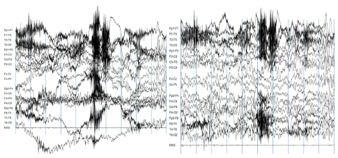
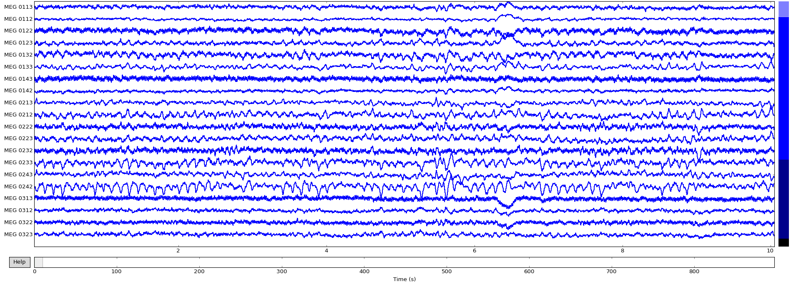
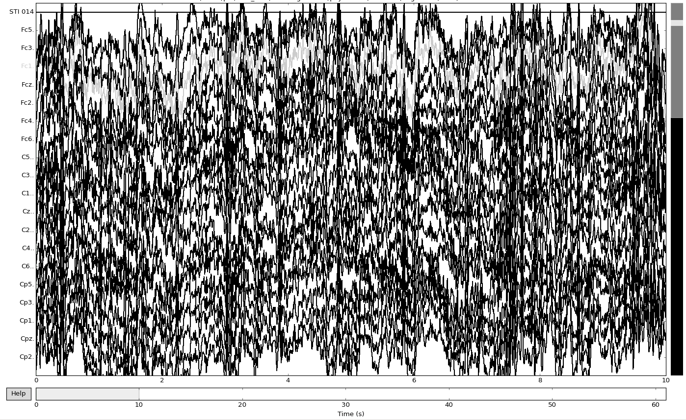
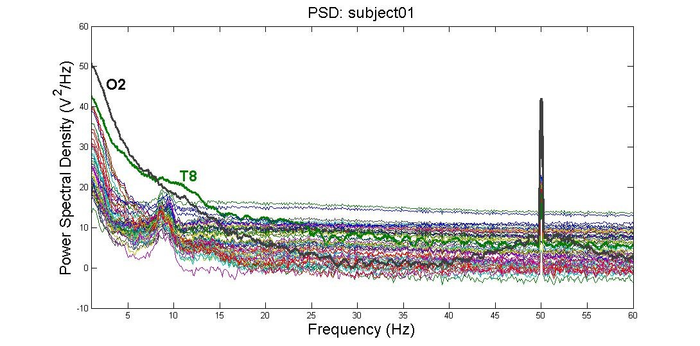
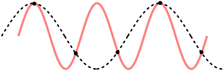
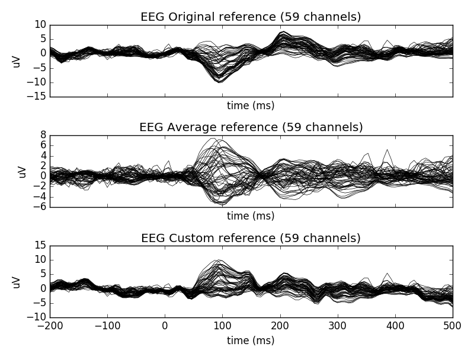
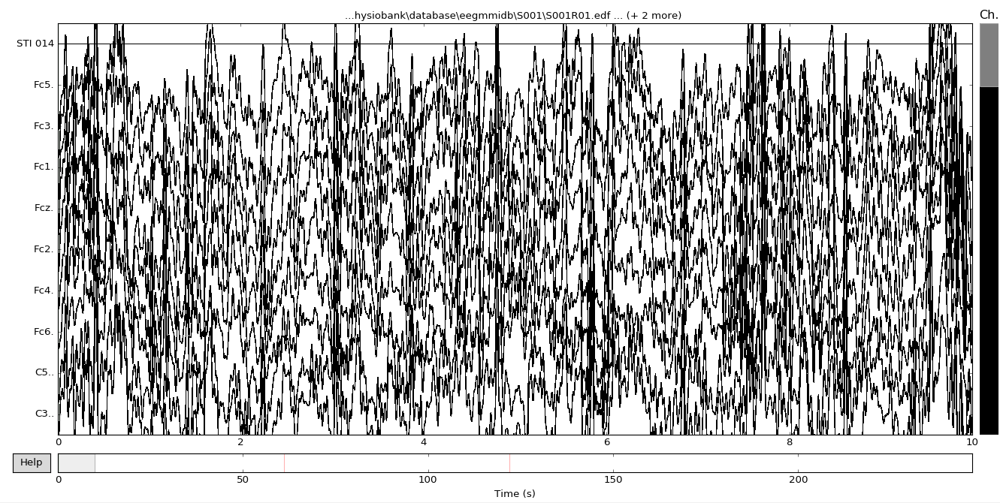
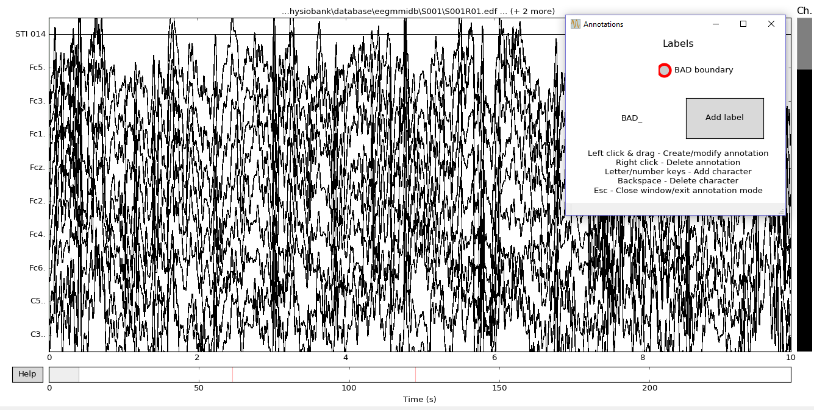
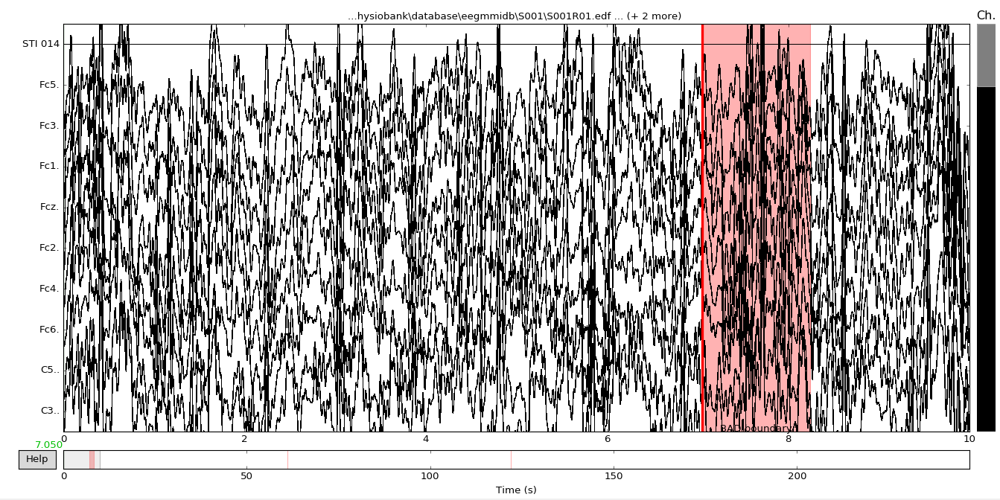
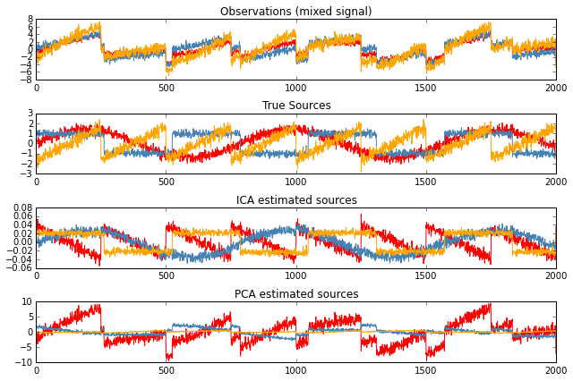

**Table of Contents**
{: #toc }
*  TOC
{:toc}

<!-- /.medium-4.columns -->

[link to notebook](https://github.com/NeuroTechX/learn.neurotechedu.com/blob/ubc-preprocessing/scripts/preprocessing.ipynb)  

# 1. What Is Preprocessing?  

In general, preprocessing is the procedure of transforming raw data into a format that is more suitable for further analysis and interpretable for the user. In the case of EEG data, preprocessing usually refers to removing noise from the data to get closer to the true neural signals.  

### 1.1. Why is preprocessing needed?    
There are several reasons why preprocessing is necessary for EEG data. First of all, the signals that are picked up from the scalp are not necessarily an accurate representation of the signals originating from the brain, as the spatial information gets lost. Secondly, EEG data tends to contain a lot of noise which can obscure weaker EEG signals. Artifacts such as blinking or muscle movement can contaminate the data and distort the picture. Finally, we want to separate the relevant neural signals from random neural activity that occurs during EEG recordings.  
 

  
*An example of unfiltered (left) vs filtered (right) EEG data - Image taken from [http://clinicalgate.com/filters-in-the-electroencephalogram/](http://clinicalgate.com/filters-in-the-electroencephalogram/) [(1)](#references)*  

### 1.2. How would preprocessing differ based on the desired analysis  
As EEG preprocessing is still an active area of research, there is no universally adopted EEG preprocessing pipeline, which means that researchers have some freedom in choosing how to transform the raw data. Below are some questions that might help you choose the more appropriate preprocessing techniques:  
-    What kinds of artifacts might be present in your data? Which ones do you want to remove, and which ones do you want to flag to be aware of?  
     -     For example, depending on your experiment eye movements and blinking could be considered a source of noise but they could also reveal important patterns   
-    Is your analysis being done online or offline?     
     -     If you’re preprocessing data as soon as it arrives, you might not be able to use more computationally expensive methods  
-    Which features do you want to focus on?    
     -     For example, if you want to look at event-related potentials (ERPs), you will need to have accurate temporal information, whereas for motor imagery classification you will need accurate spatial information  

Finally, keep in mind that even the best preprocessing techniques will not be able to account for bad data - if your subjects weren’t performing the task correctly or weren’t paying attention to the task or if your equipment was malfunctioning, it may be best to simply run the experiment again, rather that trying to salvage the data.  

## 2. Importing Data   
The majority of this article will be aimed at Python users, referencing the [MNE library](https://martinos.org/mne/stable/index.html) [(2)](#references) for MEG and EEG analysis. It is also [available for C](https://martinos.org/mne/stable/manual/c_reference.html) [(3)](#references), and most of the concepts mentioned should have equivalents in other languages too. For example, if working with Matlab (or Octave), libraries such as [EEGlab](https://sccn.ucsd.edu/eeglab/), [Fieldtrip](http://www.fieldtriptoolbox.org/) and [Brainstorm](http://neuroimage.usc.edu/brainstorm/) were all created to do this sort of thing and more!   

### 2.1. FIF  
The primary file format supported by MNE is .fif, or the [Functional Imaging file format](http://martinos.org/mne/stable/tutorials/seven_stories_about_mne.html?highlight=fif#what-the-fif-does-mne-stand-for) [(4)](#references).  
To take a look at a .fif file, you can use one of the MNE example data sets, for example the somatosensory data is fetched by:  
   

>>> mne.datasets.somato.data_path() # Caution: ~589 MB download!  
Using default location ~/mne_data for somato...  
Downloading or reinstalling data archive MNE-somato-data.tar.gz at location ~/mne_data  
Downloading data from https://mne-tools.s3.amazonaws.com/datasets/MNE-somato-data.tar.gz (589.1 MB)  
[........................................] 100.00000 | (589.1 MB / 589.1 MB)   
Verifying download hash.   
Decompressing the archive: ~/mne_data/MNE-somato-data.tar.gz  
(please be patient, this can take some time)  
'~/mne_data/MNE-somato-data'  

Given the data, we can now use the MNE function [read_raw_fif](http://martinos.org/mne/dev/generated/mne.io.read_raw_fif.html) [(5)](#references)to read the data from the file into memory:  
  

  
>>> path = mne.datasets.somato.data_path() + '/MEG/somato/sef_raw_sss.fif'  
>>> raw = mne.io.read_raw_fif(path) 
Opening raw data file /home/pat/mne_data/MNE-somato-data/MEG/somato/sef_raw_sss.fif...  
    Range : 237600 ... 506999 =    791.189 ...  1688.266 secs  
Ready.  
Current compensation grade : 0  

  

This contains a collection of metadata about the recording - all can be listed at raw.info, or alternatively single pieces are accessible via:  

 
>>> raw.info.get('nchan') # number of channels  
316  

To inspect all the data, we can use MNE’s inbuilt plotting functionality:  

 
>>> raw.plot()  

    

Now that the data is loaded, the raw recordings are all accessible:  

 
>>> raw.get_data().shape # (channels, recordings)  
(316, 269400)  
>>> raw.get_data()[0] # 269400 recordings for the first channel, as numpy array  
array([ -5.57487584e-12,  -2.98327676e-12,   3.76587444e-12, ...,  
        -6.26239056e-12,  -9.57932650e-12,  -1.47683897e-11])  

MNE also supports writing raw data back out to FIF, which is useful when combined with preprocessing above for storing processed values for later use:  

 
>>> raw.save(‘example.raw.fif')
Writing ~/example.raw.fif
Closing ~/example.raw.fif [done]

For a full example of the reading and writing of FIF files, including some of the options available for each, you can also see the [MNE tutorial on the topic](http://martinos.org/mne/dev/auto_examples/io/plot_read_and_write_raw_data.html) [(6)](#references).  

### 2.2. EDF / EDF+  
A second example of a file format that is often used for EEG content is EDF, the European Data Format. “.edf” files contain a human-readable header, followed by a large chunk of binary data containing the raw signal for each electrode. Related is [EDF+](http://www.edfplus.info/specs/edfplus.html), a later format that improves on EDF.  

MNE itself contains a collection of EDF files as sample datasets - for example, to load one EDF from its eegbci set:   

 
>>> path = mne.datasets.eegbci.load_data(1, 1) # Note: 1.2 MB  
>>> path[0]  
u'~/mne_data/MNE-eegbci-data/physiobank/database/eegmmidb/S001/S001R01.edf'  

From inspecting the file, we can observe that it starts with:  

 
0 X X X X  Startdate 12-AUG-2009 X X BCI2000  12.08.0916.15.0016896 EDF+C                                       61 1 65 
  
etc…, which corresponds to some per-recording metadata, as detailed here:  
[http://www.edfplus.info/specs/edf.html](http://www.edfplus.info/specs/edf.html)[(7)](#references). In this example, you can see that it’s recording from August 12, 2009 at 4:15pm.  

MNE provides the function mne.io.read_raw_edf (8) to load the file:  

>>> raw = mne.io.read_raw_edf(path[0], preload=True)   
Extracting edf Parameters from /home/pat/mne_data/MNE-eegbci-data/physiobank/database/eegmmidb/S001/S001R01.edf...   
Setting channel info structure...   
Creating Raw.info structure...   
Reading 0 ... 9759  =      0.000 ...    60.994 secs...   
Ready.   

Once loaded, it can be manipulated in the same way as the FIF files mentioned above.   

When given preload=True, this will load it all into memory at the time of call. Data can now be inspected in the same way as described above for FIF files, e.g. calling:   

>>> raw.plot()   

  

### 2.3. Other (CSV / .mat)  
There are lots of different file formats in use for EEG data across the world. For example, it’s common to come across matlab .mat files, or the textual comma-separated variables (CSV) for storing the signals. Assuming you can read the samples into a big matrix of recordings (e.g. using scipy.io.loadmat (9) for .mat, or numpy.genfromtxt (10) for .csv), MNE also provides a way to convert these into the format it uses:  

>>> ch_names = [‘A’, ‘B’] # channel names   
>>> sfreq = 200 # sampling frequency, in hertz  
>>> info = mne.create_info(ch_names, sfreq) # See [docs](http://martinos.org/mne/stable/generated/mne.Info.html) for full list of Info options.   
>>> samples = np.array([[-1, 0, -1], [0, 1, 0]]) # Samples for each channel  
>>> raw = mne.io.RawArray(samples, info)   

This can now be used like the raw variables above that were loaded from FIF or EDF.  

## 3. Removing Bad Channels  

### 3.1. What is a ‘bad’ channel?  
Sometimes EEG data (especially high-density EEG data) will contain ‘bad’ channels that do not provide accurate information. It is important to remove those from analysis early on because keeping that data will affect further analysis. There are a few reasons why a channel might be excluded:  
- The channel is malfunctioning for some reason   
- The electrode was improperly placed or didn’t have contact with the scalp  
- (if working with wet electrodes) Two or more channels were bridged   
- (if working with wet electrods) The electrode got saturated  

### 3.2. How to spot a bad channel  
You can detect bad channels even before you have finished collecting the data. For example, if you know one of the channels was not functioning properly or if you noticed that one of the electrodes lost contact with the scalp during the experiment, you can mark it to be excluded from analysis.   

The most common way of detecting bad channels after the data has been collected is by visualizing the raw data. Using MNE, this can be done by the following command:   

raw.plot()  

Now you can look for channels that either have no signal (a flat line) or seem significantly noisier than others. Note that the decision to remove a channel post-hoc because of high noise level can be a bit arbitrary - use your experience and judgement to determine how much noise is appropriate. You can then mark bad channels, either via an MNE command:  

raw.info['bads'] += ['names of channels to remove']    

Or interactively, by clicking on the channel line or channel name in the window. The channels you clicked on will then be marked as bad once you close the window.  

### 3.3. How to remove a bad channel from the data  

Once you have identified the bad channels, you can exclude them from further analysis by picking a subset of channels that excludes the ones marked as ‘bad’:  

picks = mne.pick_types(raw.info, exclude='bads')   

Now when you do further analysis, you can set picks as the channels that will be analysed. For example, if you want to split the data into epochs,  

epochs = mne.Epochs(raw, events, event_id, tmin, tmax, picks=picks,  
                    baseline=(None, 0), reject=reject, preload=False)   
                    

will have the bad channels excluded since picks does not contain bad channels.  

Note that if you have a lot of bad channels, or if you don’t have many channels to begin with, simply removing bad channels will result in a significant loss of information. In those case, you might want to repair or interpolate the excluded channels instead - see [Section 7] (#re-referencing-and-interpolation) for more details.  

## 4. Filtering   

When looking at the frequencies of a digital signal, whether it be audio, EEG, or otherwise, a popular thing to do is to *filter* certain frequencies, such that either some frequencies are removed, or possibly that some filters remain. There are a number of types of filters:   

- *Low-pass filter:* ‘Low’ frequencies below a certain value are kept (they ‘pass’), while high frequencies are removed. This is also known as a high-cut filter. It may help to think of the audio version of this, which would be something that removed all the high notes from a sound.  
- *High-pass filter (a.k.a Low-cut):* The same as above, but only high frequencies remain, and only those below a certain value are removed.  
- *Band-pass filter:* Combining the two, this keeps only frequencies between a lower and upper bound. The opposite is a band-cut filter, which removes all frequencies in a particular range.  
- *Notch filter:* This is a special type of band-cut filter, that removes a single frequency. It is also possible to combine multiple notch filters, to remove a particular set of single frequencies, useful for things like removing electricity noise.  

In the world of EEG, these are useful for a number of things when processing your signal.  
- *Removing electricity noise:* generally the electrical circuits surrounding your measurement will introduce noise in the 50Hz or 60Hz range (plus multiples).   
        
This image (from [http://blricrex.hypotheses.org/ressources/eeg/pre-processing-for-erps](http://blricrex.hypotheses.org/ressources/eeg/pre-processing-for-erps) [(11)](#references)) shows clearly some 50Hz noise from electricity. To remove these, a notch filter can be performed on the raw signal with MNE to remove 50Hz and its multiples.  

raw.notch_filter(np.arange(50, 251, 50))  

  

Often you only care about a certain frequency range - e.g. if looking at alpha waves, only the 7.5Hz - 12.5Hz range is needed, so it can be useful to perform a band-pass filter between these values to remove any noise outside that range:  

mne.filter.filter_data(raw, sFreq, l_freq=7.5, h_freq=12.5)  

  

High-pass filtering can be added to remove very low frequency signals. These are too slow to originate from the brain, and are usually a sign of long-term drift in the recording environment.  

Care needs to be taken when performing any filtering however, to ensure that it introduces no extra source of error. For more details on where potential pitfalls have been found, see the [MNE documentation](https://martinos.org/mne/stable/auto_tutorials/plot_background_filtering.html#some-pitfalls-of-filtering) [(12)](#references) on filtering issues.  

## 5. Downsampling  

### 5.1. Background  

Imagine that we have an EEG system with 64 channels, and a sample rate of 600 samples per second (or 600 Hz = hertz). If we are representing each sample as a 32-bit float, this is (64 * 600 * 32) = 1,228,800 bits per second, or 150 kb/sec of data.  

While it might not seem like much, consider that all of this information will be likely transmitted across wireless signal, processed multiple times, and stored. This would all be improved if the number could be lowered. It can be problematic though to reduce the number of channels, which leaves the question: how can the sampling rate be reduced?  

This is where downsampling comes in: it’s a technique to reduce the number of samples used, while still (hopefully) maintaining the information that is needed. It comprises a few pieces:  

- *Strict Downsampling* is what you might think of first when deciding how to reduce the number of samples: just keep every Nth (e.g. every second, or third, or …). This is technically what the term ‘downsampling’ refers to, however it is rarely used in isolation. Similar to how image resizing works, this tends to lead to artifacts in the result (called *aliasing*), which is problematic. For those who are interested in more details, this [youtube video](https://www.youtube.com/watch?v=yWqrx08UeUs)[(13)](#references) is a good start.  
- *Decimating* is downsampling too, but first performing a low-pass filter (see [section 5](#filtering) on filtering) to remove the high frequencies that cause the artifacts. For more info on exactly what is filtered, see the notes and the end of this section.   

### 5.2. Achieving in MNE  

MNE provides the ‘resample’ method that will perform the decimating technique described above:  

# Resample to 100 Hz
raw_resampled = raw.copy().resample(100, npad='auto')  

  

### 5.3. Notes on downsampling   

#### 5.3.1. Frequencies   

The first thing important to consider when it comes to sampling is what is known as the [Nyquist–Shannon sampling theorem](https://en.wikipedia.org/wiki/Nyquist%E2%80%93Shannon_sampling_theorem) [(14)](#references) (or, usually any time someone mentions ‘Nyquist’ at all). Despite its fancy name, it’s really just a rule relating the information you can get out of a sampled signal. Put simply: if you are sampling at a rate of R Hz, then any signal of frequency above half of that (i.e. R/2 Hz) will be mistaken for a lower frequency. This process is also known as *‘Aliasing’*, as the higher frequency is *aliased* to the lower one. To see why, consider the sample points (black dots), for a high-frequency signal (red) and low-frequency one (black dashes). The sampled points are identical, so a higher sampling rate is required before they can be differentiated.  
  
This is important when it comes to the EEG signal you are processing. For example, if you are detecting Alpha waves (up to 15Hz), this means you’ll need at least a sample rate of 30Hz to ensure the 15Hz signal is detectable. Similarly, if considering Gamma waves up to 100Hz, a sample rate of 200Hz is the lowest possible. What is more, depending on the techniques performed an even higher frequency is preferred. It is important to downsample only as much as required, and be aware that this may modify the results slightly.  

#### 5.3.2. Non-integer ratios  

You may have noticed that the *Strict Downsampling* section talked about keeping every Nth sample. This is possible if the final rate should be ½, ⅓, ¼,  … of your initial rate, but you may wish for more complex ratios between the two. For any rational fraction (e.g. ⅔, ¾, …) this can be achieved by first *upsampling* by one number, and then downsampling by a second. For example, to go from 200Hz to 160Hz (for a ratio of 0.8 = ⅘), this can be achieved by upsampling by 4, then downsampling by 5.  

## 6. Re-referencing And Interpolation   

### 6.1. What is referencing?  

In EEG data, the voltage for each electrode is recorded relative to other electrodes. The ‘reference’, which can be one or a combination of electrodes, is what the voltage will be relative to. This means that neural activity at the reference electrode will also be reflected in all the other electrodes, which could contaminate your signal. This also means that your choice of reference will have a critical impact on your data, as illustrated below:   

  
*The same EEG dataset with different choices of reference - Image taken from [http://martinos.org/mne/stable/auto_examples/preprocessing/plot_rereference_eeg.html#sphx-glr-auto-examples-preprocessing-plot-rereference-eeg-py](http://martinos.org/mne/stable/auto_examples/preprocessing/plot_rereference_eeg.html#sphx-glr-auto-examples-preprocessing-plot-rereference-eeg-py) [(15)](#references)*  

### 6.2. How are references chosen?   

When picking a reference, it is important that the electrode(s) that you’re selecting as a reference have as little influence on the locations of your signal of interest as possible. In practice, this means that either the references are located far away from the signal of interest or an average of several electrodes is used.   

Some common choices of reference include:   

- Mastoids (the electrodes placed roughly behind a person’s ears), due to being relatively far from the brain yet close to the other electrodes. However, there is still some neural activity at that location. The average of the two mastoids or the average of the two earlobes is also commonly used.  
- Cz (the central electrode) is frequently chosen when looking at activity that is distant from that location.  
- The average of all electrodes. This choice of reference reduces the impact that any single malfunctioning electrode will have on the results and is the default choice of reference in MNE.  

Any given EEG headset comes with a pre-defined reference; however, it is possible to re-reference the data after data has been collected. In MNE, you can change the reference via the   
set_eeg_reference()
 command.    

By default, MNE re-references data to the average of all electrodes, but you can also set the average reference explicitly:   

raw.set_eeg_reference()  

will set the reference to the average. To set the reference to the default that came with the headset, you can use   

raw.set_eeg_reference([])  

  

To set the reference to a custom combination of electrodes, you can use   

raw.set_eeg_reference([electrodes_to_use])  

 

Which will set the reference to the average of the electrodes in [electrodes_to_use].  

### 6.3. Interpolation  

After flagging bad channels, it is common practice to interpolate data for the bad channels based on the data from the good channels. Interpolation is a way of filling in the missing data based on the other data available.  

There are a few ways of interpolating EEG data, but by far the most common is interpolation by spherical splines. This method consists of the following steps:   

1. Project the channel locations onto a unit sphere (representing the head)   
2. Compute a matrix that describes the relationship between the good and bad electrodes   
3. Use the result from (2) to interpolate the data for bad electrodes  

A detailed description of the method can be found at [http://martinos.org/mne/stable/manual/channel_interpolation.html#channel-interpolation](http://martinos.org/mne/stable/manual/channel_interpolation.html#channel-interpolation) [(16)](#references).  

This method can be easily implemented in MNE via the following command:   

raw.interpolate_bads(reset_bads=False)  

  

## 7. Artifact rejection and correction  

### 7.1. Types of artifacts   

Artifacts are signals that are picked up by the EEG system but do not actually originate from the brain. There are many different sources of artifacts for EEG data, which will manifest themselves differently. EEG artifacts can be roughly classified as biological or environmental.  

- *Environmental artifacts* originate from outside-world interference - for example, power lines, electrodes losing contact or other people’s movement during the experiment. The easiest way to minimize the effect of those artifacts is by adjusting the environment (e.g shielding the room, properly securing the electrodes). Power line interference can be removed by applying a notch filter at 50 or 60 Hz, and in fact, this filter comes pre-built in some headsets.   

- *Biological artifacts* originate from sources in the body. Some of the most common biological artifacts are blinks, eye movements, head movements, heart beats and muscular noise. It is possible to detect those artifacts if you have access to other biometric data, for example, accelerometer, electrooculogram (EOG) or eye tracking data for eye movement artifacts, accelerometer data for head movement artifacts and electrocardiogram (ECG) data for heartbeat artifacts.   

### 7.2. Rejection based on visualization   

One way of finding artifacts is by simply looking at the data, as biological artifacts tend to have recognizable patterns. For example, if you plot the sample BCI dataset from MNE:  

from mne.datasets import eegbci  
from mne.io import concatenate_raws, read_raw_edf  

subject = 1  
runs = [1,2,3]   
raw_fnames = eegbci.load_data(subject,runs)  
raw_files = [read_raw_edf(f, preload=True) for f in raw_fnames]  
raw = concatenate_raws(raw_files)  
raw.filter(0.5, 30)  
raw.plot(n_channels=10, block=True)  

  

  

...and annotate noisy segments to remove them later. You can press the ‘a’ key to enter annotation mode:  

  

Now you can flag noisy-looking segments by left-clicking and dragging. By default, the annotated segments will be marked as ‘bad’, but you can create different labels if you wish by clicking ‘Add label’.  

   

As you compile the data into epochs for further analysis, the marked segments will be rejected automatically.  
Note that finding artifacts based on their visualization can be unreliable since it relies on observer judgement. However, there are ways to detect bad segments automatically, for example, based on the variance or the amplitude of the signal. For example, MNE provides a way to automatically reject epochs based on the peak-to-peak amplitude: each Epoch has a *reject* dictionary that contains the channel types and the threshold amplitude values. You can set those values by creating a dictionary:     

reject = dict(eeg=5e-6) #if you have EOG, MEG or other data, you can set the thresholds for those as well   

  

...passing this dictionary you created when you construct your epochs...  

epochs = mne.Epochs(raw, events, event_id, tmin, tmax, proj=True,  
                    reject=reject, reject_by_annotation=True)  
                    
  

...and dropping the rejected epochs:   

epochs.drop_bad()  

  

When you run this command, you should be able to see how many epochs were dropped. You might need to adjust the thresholds based on how many epochs were rejected, since those values are highly dependent on the data you have.    

## 8. Preprocessing for High Density (Research EEG)  vs Low Density (Consumer EEG)  

High density EEG systems carry a large momentum of research, which is great in terms of standardized research, but leads to complications for innovations in lower density EEG headsets and their preprocessing. Overall, the main differences in preprocessing are in channel removal (due to smaller amount of channels), using event-markers (due to Bluetooth lag), Data quality (due to non-standard electrodes), referencing and ERP morphing (due to non-standard locations). [(17 18)](#references)  
Still, in 2017, Krigolson tested the Muse headset (Low Density EEG) compared to the 64-electrode ActiCAP (High Density EEG) in detecting P300 and N200 ERPs from an oddball paradigm and reward-learning task. They showed success with Muse headset despite these complications.[(17)](#references)   

### 8.1. Channel Removal  

With High Density EEG caps, the occasional bad channel is simply deleted. Since there are enough other channels to compensate, there is no significant impact on whatever data analysis is done.   
In Low Density EEG systems, however, the amount of channels is limited, so rejection of noisy channels is not feasible. Hence the importance of appropriate training for whoever is setting up the hardware, in order to reduce noise. [(17)](#references)   

### 8.2. Using Event-Markers   

Event-Markers are a time measurement of when an event is expected to occur, in order to simplify ERP analysis. It is extremely common with high density EEGs, because they are connected to a computer through cables. However, many Low Density EEG systems are connected through Bluetooth, which has a lag of tens of milliseconds that varies in the magnitude of tens of milliseconds (Krigolson 2017 reported 40ms +20 ms), so the analysis cannot depend on event-markers to indicate what sections of data to analyze as an ERP. [(17)](#references)   
As an alternative to event-markers, some preprocessing protocols may identify the slope of change in a signal, and identify that it is likely an ERP [(17)](#references). Still, protocols without event-markers are not well established.   

### 8.3. Data Quality  

High Density EEG machines are often employed with wet electrodes, which provide better signal quality than dry electrodes [(18)](#references). The issue of signal quality is further complicated by the limited amount of channels in Low Density EEGs, since a bad channel cannot simply be rejected [(section 8.1.)](#channel-removal).     
Krigolson (2017) reported signal quality as the main issue in experimentation, but also claimed that sufficient quality was easily obtained once users followed guides more closely, and gained experience with the Muse system.[(17)](#references)    

### 8.4. Referencing and ERP Shape   

With High Density EEG systems, many channels are available, so there are multiple popular options for referencing (such as the mastoid channels). However, with Low Density EEG the hardware limits the referencing options. A common compromise for Low Density systems is referencing to the Fpz channel. [(17)](#references)  
A consequence of these hardware limitations is that the shape of well studied ERPs may be different. This does not necessarily alter the quantification of an ERP detected, so the analysis can still be successful. This occurs because the referencing is not done with a significant amount of channels farther away, so the signal characteristics that will stand out are different, and will lead to a non-standard shape of ERPs [(17)](#references).   

## 9. Artifact Correction   

Once preprocessing is done, the data should be clean enough to yield information about what regions of the brain are active, and what that activity is like. [(19)](#references)  

### 9.1. ICA (Independent Component Analysis)  

ICA is a technique that separates and localizes independent signals that have been added together. It was created for the cocktail party problem, in which you attempt to isolate a pertinent conversation from the noise of other conversations in, say, a cocktail party.  
The basic assumption is that if two independent signals are statistically independent, so even if they are added together, one can separate contributions that are not predictive of each other (statistically independent) [(20 21 22 23 24)](#references). Once the signals are separated, they can be localized by fitting them to fixed oscillating dipoles (see [section 9.4. Dipole Fit](#dipole-fit)). [(21 22)](#references)  
Another common use is to separate components with an ICA to identify artifacts from eye movements or heartbeats. These have characteristic shapes, and can often be identified automatically. [(28)](#references)  
This technique is generally considered the best, since it does not assume orthogonal or gaussian behavior of the individual signals, which are unreasonable assumptions that other techniques depend on. [(20 23 24)](#references)  
Applied to EEG and EMG, ICA is much more effective than its simpler counterpart, PCA (Principal Component Analysis), which assumes that all signals are orthogonal, and creates a succession of orthogonal base vectors where each vector will account for as much variance as possible. [(20)](#references)  
As a result, when using PCA the first vector is significantly larger in magnitude than all the subsequent vectors. When the signal to noise ratio (SNR) is low, important information in these subsequent vectors can get lost. [(24)](#references)  
  
*Comparing ICA and PCA [(20)](#references)*   

There are multiple sources discussing ICA methods [(23 24)](#references) and how to apply them with open source libraries in MATLAB (EEGLAB) [(21 22 23)](#references) and Python (Open Python EEG) [(24 20)](#references).  

### 9.2. SSP (Signal Space Projection)  

SSP is similar to PCA in that it separates signal from noise based on orthogonality. The main assumption used is that signals and noise are generated in fixed and different positions and orientations, so their contributions a linearly independent and show stable field patterns, even though they vary in magnitude over time. Then, we take the matrix U as the orthonormal basis of all noise signals (defined previously), and define $$P_{\bot} = I − UU^T$$ as the signal-space projection operator, which removes any contribution parallel to the noise described by U. By applying the signal-space projection operator to the original signal, we keep only the signal contributions that are perpendicular to the noise expected: $$s_{SSP}(t)=P_{\bot} s(t)$$ [(25)](#references).    
This technique is extremely powerful in removing noise, especially since the matrix U, defining the expected noise, can be very selective. However, pertinent signals that are not perpendicular to the noise can get diminished, and even removed. [(24 25)](#references)  
In a comparison of ICA and SSP, it was found that both yield a similar SNR, whereas ICA performs slightly better. Furthermore, SSP produced less noise and less signal, whereas ICA carried noise forward but identified signals without reducing them.[(24)](#references)  

### 9.3. Maxwell Filters: SSS and tSSS  

Maxwell FIlters are based on Maxwell’s equations describing electromagnetism.[(26)](#references)   
SSS (Signal Space Separation) is a technique exclusive to MEG, and separates an MEG signal into components originating within the head, and outside of it. Components modeled outside of the head are simply removed from the vector basis, and their noise contributions erased. This is extremely powerful since it does not depend on any assumptions of what the external noise should be, and does not require any signal channel to be sacrificed for referencing. Still, MEG systems cannot capture radial signals.[(24)](#references)  
tSSS (temporal Signal Space Separation) is similar to SSS, but it uses the temporal consistency of signals inside the skull to differentiate the signal space of brain within the skull from artifacts generated between the skull and the sensors. This helps remove muscle artifacts (such as blinking) and artifacts due to other interfering hardware, such as EEG sensors. [(24)](#references)  

### 9.4. Dipole Fit  

Dipole fitting consists of modeling the brain’s behavior as oscillating dipoles in specific positions. It is based on the concept that brain-waves result from groups of parallel neurons firing synchronously, which can be modeled as a voltage potential dipole oscillating in a certain position. [(21 22 27)](#references)  
This concept is reasonable, as has been discussed by many publications for decades [(27)](#references). Still, the mathematical process of directly fitting oscillating dipole sources onto an EEG signal is not very trustworthy or resilient to noise, especially for signals originating deep in the brain. A much more powerful approach is to apply dipole fitting onto individual signals that have been picked apart by an artifact correction algorithm, such as ICA or SSP. In practice, running an ICA then a  dipole fit is very common [(21 22 27)](#references).  

## References  

1. Background on filters for EEG: [http://clinicalgate.com/filters-in-the-electroencephalogram/](http://clinicalgate.com/filters-in-the-electroencephalogram/)  
2. MNE Library: [https://martinos.org/mne/stable/index.html](https://martinos.org/mne/stable/index.html)  
3. MNE (C implementation): [https://martinos.org/mne/stable/manual/c_reference.html](https://martinos.org/mne/stable/manual/c_reference.html)    
4. FIF Documentation: [http://martinos.org/mne/stable/tutorials/seven_stories_about_mne.html?highlight=fif#what-the-fif-does-mne-stand-for](http://martinos.org/mne/stable/tutorials/seven_stories_about_mne.html?highlight=fif#what-the-fif-does-mne-stand-for)  
5. read_raw_fif Documentation: [http://martinos.org/mne/dev/generated/mne.io.read_raw_fif.html](http://martinos.org/mne/dev/generated/mne.io.read_raw_fif.html)    
6. Reading and Writing Raw Data in MNE: [http://martinos.org/mne/dev/auto_examples/io/plot_read_and_write_raw_data.html](http://martinos.org/mne/dev/auto_examples/io/plot_read_and_write_raw_data.html)  
7. EDF File Format Specification: [http://www.edfplus.info/specs/edf.html](http://martinos.org/mne/dev/auto_examples/io/plot_read_and_write_raw_data.html)    
8. read_raw_edf Documentation: [http://www.martinos.org/mne/stable/generated/mne.io.read_raw_edf.html](http://martinos.org/mne/dev/auto_examples/io/plot_read_and_write_raw_data.html)    
9. Loading Matrices in SciPy: [https://docs.scipy.org/doc/scipy/reference/generated/scipy.io.loadmat.html](http://martinos.org/mne/dev/auto_examples/io/plot_read_and_write_raw_data.html)    
10. Loading Matrices from .txt in NumPy: [https://docs.scipy.org/doc/numpy/reference/generated/numpy.genfromtxt.html](https://docs.scipy.org/doc/numpy/reference/generated/numpy.genfromtxt.html)    
11. [http://blricrex.hypotheses.org/ressources/eeg/pre-processing-for-erps](http://blricrex.hypotheses.org/ressources/eeg/pre-processing-for-erps)     
12. MNE Filtering Tutorial: [https://martinos.org/mne/stable/auto_tutorials/plot_background_filtering.html#some-pitfalls-of-filtering](https://martinos.org/mne/stable/auto_tutorials/plot_background_filtering.html#some-pitfalls-of-filtering)     
13. Downsampling Example: [https://www.youtube.com/watch?v=yWqrx08UeUs](https://www.youtube.com/watch?v=yWqrx08UeUs)    
14. Nyquist-Shannon Sampling Theorem: [https://en.wikipedia.org/wiki/Nyquist%E2%80%93Shannon_sampling_theorem](https://en.wikipedia.org/wiki/Nyquist%E2%80%93Shannon_sampling_theorem)    
15. Re-Referencing in MNE: [http://martinos.org/mne/stable/auto_examples/preprocessing/plot_rereference_eeg.html#sphx-glr-auto-examples-preprocessing-plot-rereference-eeg-py](http://martinos.org/mne/stable/auto_examples/preprocessing/plot_rereference_eeg.html#sphx-glr-auto-examples-preprocessing-plot-rereference-eeg-py)   
16. Channel Interpolation in MNE: [http://martinos.org/mne/stable/manual/channel_interpolation.html#channel-interpolation](http://martinos.org/mne/stable/manual/channel_interpolation.html#channel-interpolation)    
17. Validation of consumer EEG: [http://journal.frontiersin.org/article/10.3389/fnins.2017.00109/full](http://journal.frontiersin.org/article/10.3389/fnins.2017.00109/full)     
18. A direct comparison of wet, dry and insulating bioelectric  
recording electrodes (A Searle and L Kirkup 1999): [https://www.google.ca/url?sa=t&source=web&rct=j&url=http://iopscience.iop.org/article/10.1088/0967-3334/21/2/307/pdf&ved=0ahUKEwj9vYyD36nTAhVJ4mMKHfaPBGwQFggaMAA&usg=AFQjCNF6PP563IoHmjCoHLiLl1aNFReZ9g&sig2=xDblyqx0iIN6JguVhHwXZQ](https://www.google.ca/url?sa=t&source=web&rct=j&url=http://iopscience.iop.org/article/10.1088/0967-3334/21/2/307/pdf&ved=0ahUKEwj9vYyD36nTAhVJ4mMKHfaPBGwQFggaMAA&usg=AFQjCNF6PP563IoHmjCoHLiLl1aNFReZ9g&sig2=xDblyqx0iIN6JguVhHwXZQ)     
19. MNE tutorials + intro to python: [https://martinos.org/mne/stable/tutorials.html](https://martinos.org/mne/stable/tutorials.html)     
20. ICA in MNE: [http://martinos.org/mne/dev/manual/preprocessing/ica.html](http://martinos.org/mne/dev/manual/preprocessing/ica.html)     
21. Automated dipole fitting after ICA with practice datasets: [http://cognitrn.psych.indiana.edu/busey/temp/eeglabtutorial4.301/dipfittut/dipfit.html](http://cognitrn.psych.indiana.edu/busey/temp/eeglabtutorial4.301/dipfittut/dipfit.html)     
22. Makoto’s personal guide on using EEGLAB for ICA and Dipole fitting: [https://sccn.ucsd.edu/wiki/Makoto%27s_preprocessing_pipeline](https://sccn.ucsd.edu/wiki/Makoto%27s_preprocessing_pipeline)     
23. Background theory of ICA: [https://sccn.ucsd.edu/wiki/Chapter_09:_Decomposing_Data_Using_ICA](https://sccn.ucsd.edu/wiki/Chapter_09:_Decomposing_Data_Using_ICA)   
24. Comparing ICA and SSP: [https://www.ncbi.nlm.nih.gov/pmc/articles/PMC4972935/](https://www.ncbi.nlm.nih.gov/pmc/articles/PMC4972935/)     
25. SSP in MNE: [http://martinos.org/mne/dev/manual/preprocessing/ssp.html](http://martinos.org/mne/dev/manual/preprocessing/ssp.html)   
26. Maxwell fintering in MNE: [http://martinos.org/mne/dev/manual/preprocessing/maxwell.html#id4](http://martinos.org/mne/dev/manual/preprocessing/maxwell.html#id4)   
27. Dipole source localization: [https://sccn.ucsd.edu/wiki/A08:_DIPFIT](https://sccn.ucsd.edu/wiki/A08:_DIPFIT)   
28. ICA used for artifact correction: [http://martinos.org/mne/stable/auto_tutorials/plot_artifacts_correction_ica.html](http://martinos.org/mne/stable/auto_tutorials/plot_artifacts_correction_ica.html)      